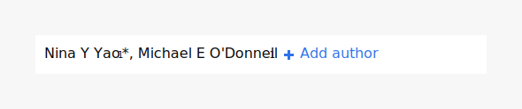

# Common actions

On this page

* Adding content
* Removing content
* Editing content
* Linking

## Adding content

### Add button

#### **Description**

Add buttons are contextual affordances that allow the user to add one or more pieces of content in place.

#### **Usage**

Use the add button to add additional information to existing content or sections of the article.

#### Examples

* Optional license information for figures or similar content types
* Adding new authors to the authors list
* Adding references to the reference section

**Related patterns**

* Append button
* Edit button
* Remove button

### **Add menu option**

\*\*\*\*

## **Removing content**

## **Editing content**

\*\*\*\*

\*\*\*\*

  

  

