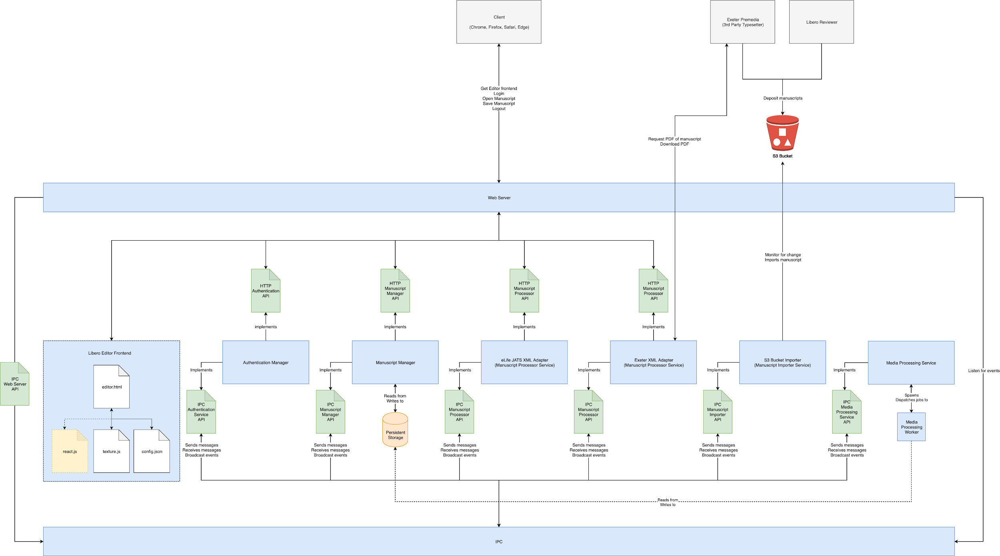

# Technical Specification

## Introduction

The document defines how technically the problems outlined in the [Libero Editor orientation document](https://drive.google.com/a/elifesciences.org/open?id=1KbBhwJ_QfquTWTC-ce1yp82A9CGHVxiVEO8EkQ_cC1Q) will be solved.

The goal for _Libero Editor_ is to provide a tool that can be used to QC, proof, and add value to content while maintaining the underlying XML structure that conforms to a set of JATS XML requirements, replacing the QC and proofing functionality of the current _Kriya_ tools used within eLife.

## Product Requirements

Libero Editor is an eLife first tool, and hence all development is geared towards delivering against the requirements of the staff at eLife. Community considerations are secondary, and will be addressed as part of the Libero Producer project. As such below is a high-level summary of the key deliverables of the project.

1. A browser based editor, that can display and allow a user to view and edit a manuscript stored in eLife’s specific JATS XML dialect.
2. A means to open/import a manuscript, including supporting files, post conversion from another system such as Kriya.
3. A means from within the editor, to invite other users to review a manuscript.
4. A means from within the editor, to propose a set of changes or corrections to the manuscript.
5. A means from within the editor to review proposed changes, and accept or reject them.
6. A means from within the editor to raise, view and respond to queries.
7. A means from within the editor to request and view a PDF of a manuscript.
8. A means to save or export a manuscript, including supporting files, post QC to another system such as Continuum.

Out of Scope

1. Conversion of a manuscript from submission format to JATS XML, we will still depend on our partner Exeter Premedia to perform this action.
2. Replacing the functionality for generating a typeset PDF, we will still depend on our partner Exeter Premedia to perform this action.
3. The ability to configure or use a different XML schema in the editor, this will be covered under the _Libero Producer_ project.

## 

## Approach

To allow us to frequently measure the solution against the goals set out in the [Libero Editor overview document](https://drive.google.com/a/elifesciences.org/open?id=1KbBhwJ_QfquTWTC-ce1yp82A9CGHVxiVEO8EkQ_cC1Q), a continuous delivery/deployment model will be leveraged which will automatically deploy a new version onto a live system for every change made, at which point a member of the Production Team staff can try and QC an article. This will allow us to quickly test and measure changes against the goals and get more immediate feedback, helping to ensure that the project is staying on track. In parallel, and until the article can be satisfactorily QC’d using the new system exclusively, the article will also be QC’d in the existing system. This does incur a time cost, as staff will for a time need to repeat work in both systems, but this an acceptable trade off as it allows us to get real feedback from a live system.

Once an _Insight Article_ can be QC’d through the new system, the tool will be further developed to support further types until a point where all article types required by eLife can be successfully QC’d through Libero Editor.

The big risk areas are around integration with Kriya, which is out of our control and as such we will be dependant on Exeter to implement functionality that is needed to complete our goals. To minimise this risk as much as possible, and based on initial discussions with Exeter, we will aim to minimise the points of interaction between the 2 systems ideally down to just a couple of import and export methods for an article, where we will store an article in our own backend whilst it is worked on and exporting it back to Kriya as required.

To summarise...

1. Create an XML editor that as seamlessly as possible slots into the existing production team workflow and replaces the QC functionality of the existing _Kriya_ tool for an _Insight Article_ only.
2. Further develop the features of the editor so that it can be used to QC all the article types currently used by eLife.

## 

## High Level Architecture

The following diagram provides a high level overview of the components and interactions for the proposed solution, with each component detailed further later in this document.

## 

## Backend

_A suite of services accessible via a public HTTPS API allowing clients to authenticate and interact with manuscripts._

The backend is a collection of microservices that combined provide all the functionality required for the Editor to achieve the goals outlined above. It provides..

* A means to serve the files required to load the Editor in a browser.
* APIs through which a user, via the Editor, can authenticate themselves and obtain a token that identifies the user and the resources that they have permission to access.
* APIs through which the Editor can retrieve and display a manuscript.
* APIs through which the Editor can edit a manuscript and create a set of proposed changes for review.
* APIs through which the Editor can display, raise and close queries.
* APIs through which the Editor can request a PDF of a manuscript.
* APIs through which a manuscript can be imported from another system.

From a clients perspective, the API appears wholistic. However behind the API gateway specific paths are handled by various services, each of which is further detailed below.

### Web Server

_The gateway for client-server interactions via a public API._

The goal of the _Web Server_ is to act as an API gateway to filter and route requests made by clients to the relevant backend service. Backend services dynamically register as handers for specific paths or resources, and once registered the Web Server will handler routing requests to the relevant endpoint, as well as serving the front-end resource files for the Editor.

Services that provide a public HTTP API are upon startup expected to register with the _Web Server_ as a provider for a specific path or type of HTTP request. To achieve this, each service can use the _Web Server’s_ IPC API to register a filter, or set of filters, and when the _Web Server_ receives a request from a client that matches those filters the request will be redirected to the relevant microservice for processing. For example, the below shows a potential filter that looks for POST, PUT or PATCH requests on any subpath of ‘/manuscripts/’ that matches the MIME type ‘application/pdf’.

`{`

 `path: “^(\/manuscripts\/)(.+)”,`

 `methods: [“POST”, “PUT”, “PATCH”],`

`content-type: “application/pdf”`

`}`

Access to the _Web Server_ will be via HTTPS only, and all API paths with the exception of those used to ‘login’ will only be accessible to authenticated users. The specifics of authentication are yet to be fully ironed out, but a token system is the preferred solution ensuring that the _Web Server_ remains stateless.

The _Web Server_ needs to support propagating events from backend services to connected clients, for example so that the Editor can notify a user when a new set of proposed changes has been submitted by another user. Hence WebSockets will be supported and provide a means for events to be forwarded to clients with minimum delay. This relaying currently will be handled by the Web Server directly, where a backend service can at registration inform the Web Server which events from the IPC system should be forwarded to clients, reducing the complexity of the backend services.

From a Service Providers perspective, consideration should be given to ensure that the server is scalable. For _Libero Editor_, there is unlikely to be many requests or con-current users interacting with the system at the same time but if the same _Web Server_ is to be used by other Libero products then ensuring it is performant whilst handling a large number of requests could be very important. To mitigate this risk, abstracting registration logic into a shared library will afford us a simple way to migrate between different technologies if we find that scalability becomes an issue. In addition, having the _Web Server_ act as a reverse proxy also ensures that it could be easily replaced in the future if required.

### IPC

_Inter-process communication for exchanging messages and events between services._

Services will need to communicate with one another, and not all communication between services needs to be done via public interfaces that are accessible to clients. Hence an IPC library will be created that allows services to interact directly with other services through message queues.

Interactions between services should be via a common fabric, that ideally allows a service to discover other services that are available, inspect the capabilities of those services and to interact with those services by sending messages or listening for events.

Only trusted services should be able to connect to and use the IPC system and, if possible, it should be possible to restrict which services can interact with each other. There are several off the shelf solutions that are suitable for our use cases, but **RabbitMQ** seems like the initial choice based on the fact that it supports all the desired features, and is used by other products in the Libero suite.

### Authentication Manager

_A service that can authenticate and validate the permissions of users._

The goal of this service is to provide clients with a means to authenticate themselves with the system, and additionally to allow services to query if a specific user has the required permissions to perform a certain operation, e.g. to upload a new revision of a manuscript.

How this works exactly still needs consideration, but put simply a client should be able to login by supplying valid credentials, and in return receive a token that can be supplied when making requests to the rest of the API. Other services can then use this token to firstly ensure the user is authenticated, and secondly to confirm that the specified user has permission to complete the operation they are requesting.

The permissions model to the system needs to be quite granular, as we have various different roles that a user could fall under. An author of a manuscript might need to be limited in what they can achieve once they have created an initial submission; A reviewer might be limited only to commenting on specific conversation threads and a member of staff might require access to everything.

Another consideration is the idea of 3rd Parties, in the sense that we might want to support interaction with the system via some form of API key, for example to allow an out-of-band service to update a revision of a document directly via the API without requiring them to authenticate at regular intervals.

The service needs to be flexible, as a user should only need to login once regardless of what they intend to do once logged in.

### Manuscript Manager

_A service that can store, version and retrieve manuscripts regardless of format._

The goal of the _Manuscript Manager_ is to provide a service that can be used to manage the change of a document as it progresses through a publishing workflow. It handles the functionality for creating a new manuscript, inserting a new revision of a manuscript, retrieval of a specific revision of a manuscript and, possibly, deletion of a manuscript.

The service should raise events when new manuscripts are created, new revisions are uploaded and when a manuscript is deleted. It could in addition also raise events when a manuscript is retrieved from the store if desired.

Internally, manuscripts will be stored inside a **Git** repository, a proven system for managing change. When a new manuscript is created, the service will generate a new UUID and create a new directory matching the UUID in the top level of its configured storage system. A Git repository will be initialised inside the new directory, and as files are added to the manuscript they will each be committed to the repository.

When an existing manuscript is to be updated, the files are unpacked into the existing directory and can then be committed as the next revision.

When a manuscript is retrieved, the callee can optionally specify a specific revision number to fetch, or by default the latest revision will be returned. At this point, the contents of the repository are archived and the result returned to the callee.

When, and if allowed, a manuscript is to be deleted the service can recursively delete the top level directory.

The service can also support tracking work in progress through branches, allowing a client to save and propose changes to a manuscript without affecting the master manuscript. Proposed changes can then be reviewed, and merged into the master manuscript down and a new revision created.

### S3 Bucket Importer

_A service that monitors s3 buckets and automatically imports new manuscripts_

The goal of this service is to monitor and import new manuscripts from an S3 bucket. 3rd Parties, specifically in this case Exeter, can deposit manuscripts into the s3 bucket and the S3 Bucket Importer will be notified by the AWS API that a new manuscript has been added. It can then fetch, analyse and if an import is desired interact with the relevant adapter service to import the article so that it is available for opening in the Editor.

### eLife JATS XML Adapter

_A service that enables support for manuscripts in eLife’s JATS XML format._

Adds support to the backend for eLife’s JATS XML format by registering as the handler for HTTP GET and PUT requests, where the HTTP request header fields for Accept/Content-Type match the MIME type for eLife’s JATS XML.

When a request is received to retrieve a manuscript, the service will first get the desired manuscript from the Storage Manager service in the native format, and then perform any required conversion before returning it to the client. When a client wishes to save a new revision of a manuscript, the service will perform a conversion, and potentially validation, and then insert the new revision into the Storage Manager service.

### Exeter XML Adapter

_A service that enables import and export of manuscripts in the Exeter XML format._

The goal of this service is to act as an adapter for the Exeter XML format. When an article is imported from Exeter via the S3 Bucket, it will need some conversion to suit our own internal format, for example stripping out of typesetting information and storing it in a separate file.

This service will also be responsible for exporting an article to Exeter’s typesetting service so that a PDF can be generated. Much like the import phase, this will require that the manuscript is converted back to the Exeter format, for example restoring typesetting information.

### Media Processing Service

_A service that can convert media files between formats._

The goal of this service is to provide a service that can be used to process supplementary materials that are provided with a manuscript, for example a figure or video file. The processor service listens for events about new files or file changes from the manuscript manager, and then can decide to take action or not. If it decides a file needs to be processed, it will create a job and place it onto a queue where a relevant worker can pick up the job and complete the operation.

Some operations might be trivial, for example converting an image from one format to another. Others might be more involved, such as transcoding a video file into a more suitable streaming format.

Ultimately, this service and it’s workers are intended to replace Glencoe, our current partner for media processing and hosting. But in this first instance a minimal version of the service will be implemented to support image files only, and extended at a later date.

## Frontend

_The part of a computer system or application with which the user interacts directly._

The backend has been designed in a generic fashion as to support many potential front ends, which allows the system to be extended or customised in the future by eLife or members of the community. This still stands, however we will be concentrating our development effort here on first producing Libero Editor, albeit targeting eLife specific functionality first.

### Libero Editor

_An open source XML editing and review tool for QC’ing a manuscript_

Libero Editor is a browser based editor that can be used by the production staff here at eLife to manage the change of an XML document as it is edited and reviewed during the QC process, ensuring that the output adheres to Libero Publisher/Continuum JATS XML format. To support this, the tool needs to be able to allow a user to open a manuscript, edit a manuscript and then submit those alterations to the backend as a set of ‘proposed’ changes. Proposed changes can then be reviewed, accepted and merged into the versions of the manuscript.

The editor itself will be built upon an existing tool, ProseMirror, which is an open source library for building browser based rich-text editors. ProseMirror is a proven. stable and well supported library that will allow us to concentrate on the business logic of the application. It can be relatively easily integrated with other libraries and frameworks, for example React, and it's modular design and plugin framework should afford us the chance to make use of the work of others rather than requiring use to build everything from scratch. 

The editor will be updated to interact with the proposed backend, allowing an authenticated user to open a manuscript from the Manuscript Manager service and permission dependant, edit the document which can then be saved to the backend as a set of proposed changes. Proposed changes will need to be reviewed and merged by a member of the production staff - or worded a little more generically a user with the relevant permissions to merge changes. Proposed changes will always need to be accepted/rejected in a linear fashion, as to ensure that merge conflicts are resolved one by one. This approach allows for a manuscript to be worked on by many users in parallel, if desired.

The tool itself will be split into a handful of reusable components, most likely React components. This will allow each component, e.g. a component to view open queries against a manuscript, to be re-used in various views or tools, e.g. Libero Reviewer, and will help with the longer term goal of producing an open source toolkit for the publishing community.

